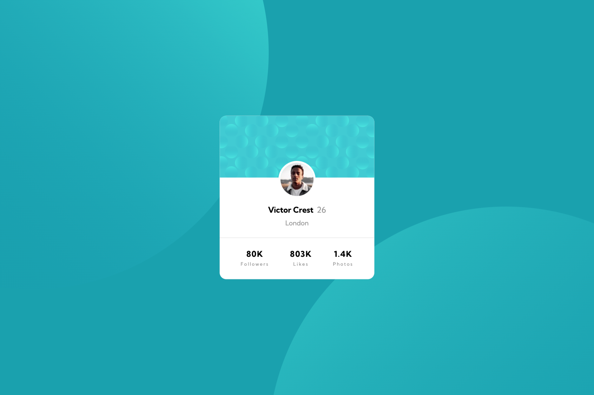

# Frontend Mentor - Profile card component solution

This is a solution to the [Profile card component challenge on Frontend Mentor](https://www.frontendmentor.io/challenges/profile-card-component-cfArpWshJ).

## Table of contents

- [Overview](#overview)
- [Goal](#goal)
- [Outcome](#outcome)
- [My process](#my-process)
- [Built with](#built-with)
- [Feedback](#feedback)
- [Lessons](#lessons)
- [Take forward](#take-forward)
- [Useful resources](#useful-resources)

## Overview

For this project, I had to make a static profile-card component for a fictional user.

## Goal

My goal for this project was to focus on Sass, time spent and to start 2025 with an easy challenge to reinstate flow!

## Outcome

I'm happy with the outcome but it wasn't easy to get there :sweat_smile:  
I might have jumped into this a bit too keenly without planning ahead as much. I thought the layout would be really straightforward but there were some finnicky parts of the design that I had trouble with. Namely, the positioning of the profile icon and the background images being responsive. I became really frustrated at one point and had to step away, but once I returned and broke down the problem, I could resolve them with only a few lines of code.

:jigsaw: [Live Site URL](https://i000o.github.io/profile-card-component/)  
:pencil2: [Solution URL](https://www.frontendmentor.io/solutions/profile-card-component-with-sass-_grmhekSel)

## Built with

:gear: Semantic HTML5 markup  
:gear: CSS Flex  
:gear: Mobile-first workflow  
:gear: Sass

## My process

:alien: First, I roughly planned my HTML for this static layout and then initiated my project files, Sass etc. to keep the repo organised.  
:alien: I got into the HTML and initial stylings like font, background color etc. I initially loaded in the image file path wrong so for a long time, the bg-image wouldn't show up, which frustrated me. I found that I shouldn't assume ease to a project and then overlook discrete details because I'm rushing. I was a bit overly-eager with this one after Christmas.  
:alien: I found most of the styling quick and easy. Particularly, I'm really speedy with structuring these divs where perhaps three pieces of information lay in a `flex: row` in amongst a `column` layout. I can make them behave how I need them to really fast and make good use of the `order` property if I need to. I feel very comfortable with `justify-content: space-around/space-evenly;` for instance and `flex-start`/`flex-end` which feels good.  
:alien: Once I got the main styling down, I wondered how I would work with the profile image, which cuts exactly halfway between two pieces of the DOM; in mine, the `<aside>` for the card header image and the `<section>` element for the rest of the card. I hadn't done this before. Initially, I used `position: absolute;` and that did not work. It would behave erratically later when I tried to flex the viewport up and down. It was a nightmare and looked terrible, I knew this couldn't be the best way. It probably took me a bit too long to change it to `position: relative;`. `Position` is still somewhat mysterious to me but I hope to learn!  
:alien: I want to learn more about `width`/`height` values. Sometimes, a tiny change can make a page behave so crudely in an attempt to make it responsive and this is so frustrating. I want to get really well-acquainted with `max-width`/`max-height`, units like `em`, `px`, `%` or others to try and really fine-grain my control in these situations. I hate wrestling with them later when they don't behave how I expect. I think these are foundational properties that might get overlooked because they seem straightforward in their naming, but the browser's interpretation is more granular and it's this that I want to gain more control of in future.  
:alien: I came to a point where I was really frustrated with this. Working with `background-image` was new to me. There are so many properties to use! `background-attachment`, for instance. Using multiple bg-imgs was new, too. What frustrated me about this design was that I wanted the circles to be sort of, pinned to the card and move accordingly with viewport changes, but instead, I had to programme in specific X/Y `background-position` values and this just wasn't fun :sweat_smile:. Surely there's a better way?  
:alien: I needed to take a break at this point, so I put it away for a bit and started another project. Once I gained some flow there and found a good stopping point, I reverted back to this project to try and really understand what was 'going wrong' about it for me. As a designer, it was probably 80% of the way there, almost perfect, but these couple of things like the background images and the profile icon positioning were holding it back a lot for me. Once I found these lines of code to research further on and make adjustments to, I found that I could quite quickly get to a more frictionless and cleaner design and code file. Then, I was happy.

## Time taken

:alarm_clock: Mobile: 4hrs  
:alarm_clock: Desktop: 5hrs

## Feedback

Lots of likes on this design once I posted it.

## Lessons

1. `background-blend-mode` like in Photoshop. I didn't expect this crossover but love it.
2. Firefox Dev tools allows you to see when an img hasn't loaded into the browser, pointing to a file path issue. Saves a lot of confusion.
3. You can add multiple bg imgs and control with listed values, seperated by commas.
4. I'm speedy with flexing div items in a layout like this and adjusting space with margins.
5. I can't rely on Chrome Dev Tools for accurate viewport displays. I need to use actual browsers and mobile. This was a big lesson and I won't rely on it in future because it's so tiring and disappointing to design something in there and then have it look completely different in reality.
6. It's a bit limiting to design with only two viewport designs shared. PRO allows for full Figma file access which would help with this but at the moment, I just use my eye and get as close as possible. Not a big deal but can be troublesome if you design a 320px viewport size according to a 375px design image. Not the same thing.
7. [Control] + Space for property value options in VSCode- So helpful, saves me googling and allows me to understand the finer differentiations between one value and another, particularly string values like `contain` or `cover`.

## Take forward

:grey_exclamation: I'm speedy with divs within flex upon flex layouts!  
:grey_exclamation: No more relying on Chrome Dev Tools for precise designing, it's not accurate and I need to use my actual devices.  
:grey_exclamation: I'm well-initited in layouts like these now, I think I'll be ready to move onto more complicated ones soon.

## Useful resources

[Firefox Dev tools](/images/README%20firefox.png)  
[Background images with HTML & CSS](https://www.youtube.com/watch?v=zHZRFwWQt2w&t=501s)

# profile-card-component
